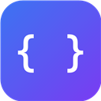

# DevKit — All-in-One Developer Tools

A Chrome extension (Manifest V3) bundling 45+ developer tools into one popup. 100% client-side: no servers, no analytics, no data collection.



## Tools

**Code & Data** — JSON formatter/validator/minifier with collapsible tree · Base64 (UTF-8 + URL-safe) · URL encode/decode/parser · HTML entities · JWT decoder with expiry check · number base converter · CSV ⇄ JSON · query string ⇄ JSON · SQL formatter · Markdown preview

**Generators** — UUID v4 (bulk) · SHA-1/256/384/512 hashes · secure password generator · QR code generator · mock/random data · Lorem ipsum

**Time** — Unix timestamp ⇄ date converter with live epoch clock and relative time · cron expression explainer with next run times

**Design** — Color converter (HEX/RGB/HSL) · screen eyedropper (EyeDropper API) · WCAG contrast checker · px ⇄ rem calculator · box-shadow generator · gradient generator

**Text** — Regex tester with live highlighting and capture groups · case converter (10 conventions) · word/character counter · line tools (sort/dedupe/reverse/shuffle) · slugify · string escaper

**Compare** — Text diff · JSON structural diff · list compare (A-only/B-only/shared) · text similarity (Levenshtein + inline word diff) · date/time diff · number diff (delta/%/ratio) · image pixel diff

**Reference** — HTTP status codes · MIME types · User-Agent parser

**Page Tools** — Element ruler (hover for size/box-model/selector) · font inspector · outline-all-elements overlay · page color palette extractor · visible-tab screenshot (download or copy)

**Page Analysis** — SEO/meta audit (title/description lengths, OG/Twitter cards, H1s, missing alts) · performance metrics (TTFB, FCP, LCP, CLS, resource breakdown) · localStorage/sessionStorage/cookie viewer with delete/clear · framework & tech detector

## Install (development)

1. Open `chrome://extensions`
2. Enable **Developer mode** (top right)
3. Click **Load unpacked** and select this `devkit` folder
4. Pin DevKit to the toolbar. Keyboard shortcut: `Alt+Shift+D`

## Testing checklist

- Utility tools work entirely inside the popup — open the popup on any page.
- Page tools (ruler, fonts, outline, palette, storage, SEO, performance, tech) need a normal `http(s)` page — they cannot run on `chrome://` pages or the Web Store.
- Overlays toggle: click the button again, or press `Esc` on the page.

## Publishing to the Chrome Web Store

1. Bump `version` in `manifest.json`.
2. Create the upload zip (from the parent directory):
   ```powershell
   Compress-Archive -Path devkit\manifest.json, devkit\background, devkit\popup, devkit\content, devkit\icons -DestinationPath devkit-v1.0.0.zip -Force
   ```
3. Upload at the [Chrome Web Store Developer Dashboard](https://chrome.google.com/webstore/devconsole) (one-time $5 registration).
4. Fill the listing using `store/listing.md` (description, permission justifications, screenshots).
5. Host `store/privacy-policy.html` anywhere public (GitHub Pages works) and paste its URL into the listing's privacy-policy field.
6. Under **Privacy practices**, declare: no user data collected, no remote code.

## Architecture

- `manifest.json` — MV3, permissions: `activeTab`, `scripting`, `storage` only (no broad host permissions → faster review).
- `popup/popup.js` — `DK` core: tool registry, DOM helpers, clipboard/toast, theme, `runInPage()` wrapper around `chrome.scripting.executeScript`.
- `popup/tools/*.js` — each tool registers itself with `DK.register({id, name, group, render})`.
- `content/*.js` — self-toggling overlay scripts (inject once = on, inject again or `Esc` = off).
- Page-analysis functions are serialized into the page by `chrome.scripting` — they must stay self-contained (no closures over popup scope). Tech detection runs in the `MAIN` world to see page globals.

## License

MIT — do whatever you like, attribution appreciated.
